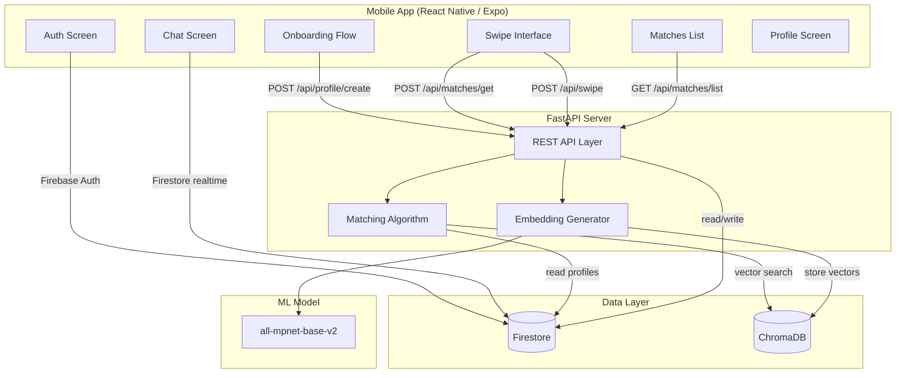
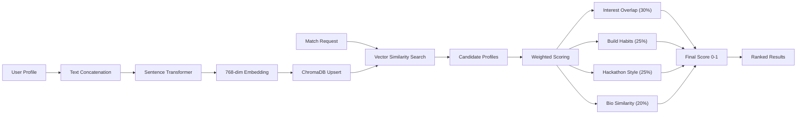

# LinkUp

[](https://expo.dev)
[](https://reactnative.dev)
[](https://fastapi.tiangolo.com)
[](https://firebase.google.com)
[](https://typescriptlang.org)
[](https://python.org)
[](LICENSE)

**Find your next hackathon teammate.** LinkUp matches developers based on interests, build habits, and working style -- not just a bio and a profile picture. Swipe through profiles, get scored on actual compatibility, and start building together.

---

## What it does

Most hackathon teams get thrown together in a Discord channel five minutes before the event starts. That rarely works out well. LinkUp takes a different approach: it asks you a handful of questions about how you actually like to build things, runs your answers through a matching algorithm, and surfaces people you would probably work well with.

The matching considers things like:
- What tech areas you care about (frontend, AI/ML, mobile, etc.)
- Whether you're more of a planner or a "just start coding" person
- How you feel about team size, solo vs. collaborative work
- Your hackathon experience and preferred pace

It scores all of this and ranks potential teammates by compatibility. If two people swipe right on each other, they match and can start chatting.

---

## Features

- **Onboarding flow** -- two-step setup where you pick interests and dial in your build style using sliders. Takes about a minute.
- **Swipe interface** -- Tinder-style card swiping with gesture support. Cards show the other person's interests, tagline, bio, and a compatibility percentage.
- **Matching algorithm** -- weighted scoring across four dimensions (interest overlap, build habits, hackathon scenarios, and semantic bio similarity). Not just random suggestions.
- **Mutual matching** -- both people have to like each other before a match is created. No one-sided connections.
- **Chat** -- real-time messaging between matched users through Firestore.
- **Profile management** -- view and update your own profile from the profile tab.
- **Google + email auth** -- sign in with Google or create an account with email/password.

---

## System Architecture



### How the matching works



The backend takes the user's profile fields, joins them into a text blob, and passes it through `all-mpnet-base-v2` to get a 768-dimensional embedding. That embedding goes into ChromaDB. When someone asks for matches, the system pulls the nearest neighbors by vector distance, then layers on a more structured comparison of interests, slider values, and preferences. The final score is a weighted sum of all four dimensions.

---

## Project Structure

```
linkup/
  mobile/                  # React Native app (Expo)
    app/
      _layout.tsx           # Root layout with auth routing
      auth.tsx              # Login / sign up screen
      index.tsx             # Entry redirect
      (tabs)/
        _layout.tsx         # Tab navigator
        swipe.tsx           # Main swiping screen
        matches.tsx         # Matched users list
        profile.tsx         # User profile view
      onboarding/
        step1.tsx           # Interests + build habits
        step2.tsx           # Hackathon prefs + bio
      chat/
        [matchId].tsx       # Chat with a matched user
    components/
      SwipeCard.tsx         # Profile card component
      Slider.tsx            # Custom slider input
    lib/
      api.ts                # Backend API client
      firebase.ts           # Firebase config
      colors.ts             # Design system colors

  backend/                  # Python backend
    main.py                 # FastAPI app + matching logic
    requirements.txt        # Python deps
    Dockerfile
    docker-compose.yml
    .env.example
```

---

## Getting Started

### Prerequisites

- Node.js 18+ and npm/bun
- Python 3.9+
- Expo CLI (`npm install -g expo-cli`)
- A Firebase project with Firestore and Authentication enabled
- Docker (optional, for running the backend)

### 1. Clone the repo

```bash
git clone https://github.com/your-username/linkup.git
cd linkup
```

### 2. Set up the backend

You can run it with Docker or locally. Docker is easier.

**With Docker:**

```bash
cd backend
cp .env.example .env
# Place your firebase-credentials.json in this directory
docker-compose up --build
```

**Without Docker:**

```bash
cd backend
python -m venv venv
source venv/bin/activate   # or venv\Scripts\activate on Windows
pip install -r requirements.txt
cp .env.example .env
# Place your firebase-credentials.json in this directory
python main.py
```

The API runs on `http://localhost:8000`. Swagger docs are at `/docs`.

### 3. Set up the mobile app

```bash
cd mobile
npm install   # or bun install
```

Update `lib/firebase.ts` with your Firebase project config. If you're testing on a physical device, change the `API_BASE` in `lib/api.ts` to your machine's local IP.

```bash
npx expo start
```

Scan the QR code with Expo Go, or press `a` for Android emulator.

### 4. Firebase setup

You'll need these enabled in your Firebase project:
- **Authentication** -- Email/Password and Google sign-in
- **Cloud Firestore** -- for user profiles, swipes, matches, and messages
- **Service Account Key** -- download the JSON and put it in `backend/` as `firebase-credentials.json`

---

## API Reference

| Method | Endpoint | Description |
|--------|----------|-------------|
| `GET` | `/` | Health check |
| `POST` | `/api/profile/create` | Create or update a user profile |
| `GET` | `/api/profile/{user_id}` | Get a user's profile |
| `POST` | `/api/matches/get` | Get ranked match suggestions |
| `POST` | `/api/swipe` | Record a like or pass |
| `GET` | `/api/matches/list/{user_id}` | List mutual matches |
| `POST` | `/api/recompute` | Recompute all embeddings (admin) |

---

## Tech Stack

| Layer | Tech | Why |
|-------|------|-----|
| Mobile | React Native + Expo | Cross-platform, fast iteration, good DX |
| Navigation | Expo Router | File-based routing, feels natural |
| Auth | Firebase Auth | Google sign-in + email out of the box |
| Database | Cloud Firestore | Real-time sync, no server needed for chat |
| Backend | FastAPI | Fast, async, automatic OpenAPI docs |
| Embeddings | Sentence Transformers | Solid semantic similarity without a GPU |
| Vector DB | ChromaDB | Lightweight, embeddable, good enough for this scale |
| Containerization | Docker | Consistent environments, easy deploy |

---

## Known Limitations

- The sentence transformer model download is around 400MB on first run. Be patient.
- Google sign-in requires proper OAuth client IDs -- the template values in `auth.tsx` need to be replaced.
- Chat doesn't have push notifications yet.
- No image uploads for profile pictures. Avatars are generated from initials.
- The matching algorithm works best with at least 10-15 users in the system.

---

## Contributing

Open an issue or submit a PR. Keep it simple -- this is a hackathon project, not enterprise software.

---

## License

MIT
